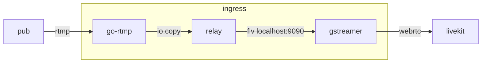
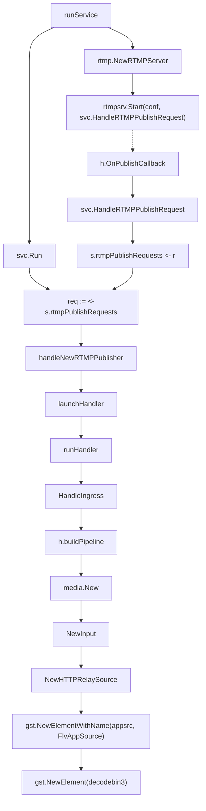

# ingress

```mermaid
graph LR;
  pub-->|rtmp|go-rtmp
  gstreamer-->|webrtc|livekit;
  subgraph ingress
  go-rtmp-->|io.copy|relay-->|flv localhost:9090|gstreamer
  end
```

```mermaid
graph TD;
  runService-->svc.Run-->Q[req := <-s.rtmpPublishRequests]-->handleNewRTMPPublisher-->launchHandler-->runHandler-->HandleIngress-->h.buildPipeline--> media.New-->NewInput-->NewHTTPRelaySource-->X["gst.NewElementWithName(appsrc, FlvAppSource)"]-->QQ["gst.NewElement(decodebin3)"]
  runService-->rtmp.NewRTMPServer-->Z["rtmpsrv.Start(conf, svc.HandleRTMPPublishRequest)"].->h.OnPublishCallback-->svc.HandleRTMPPublishRequest-->T[s.rtmpPublishRequests <- r]-->Q

```

  
