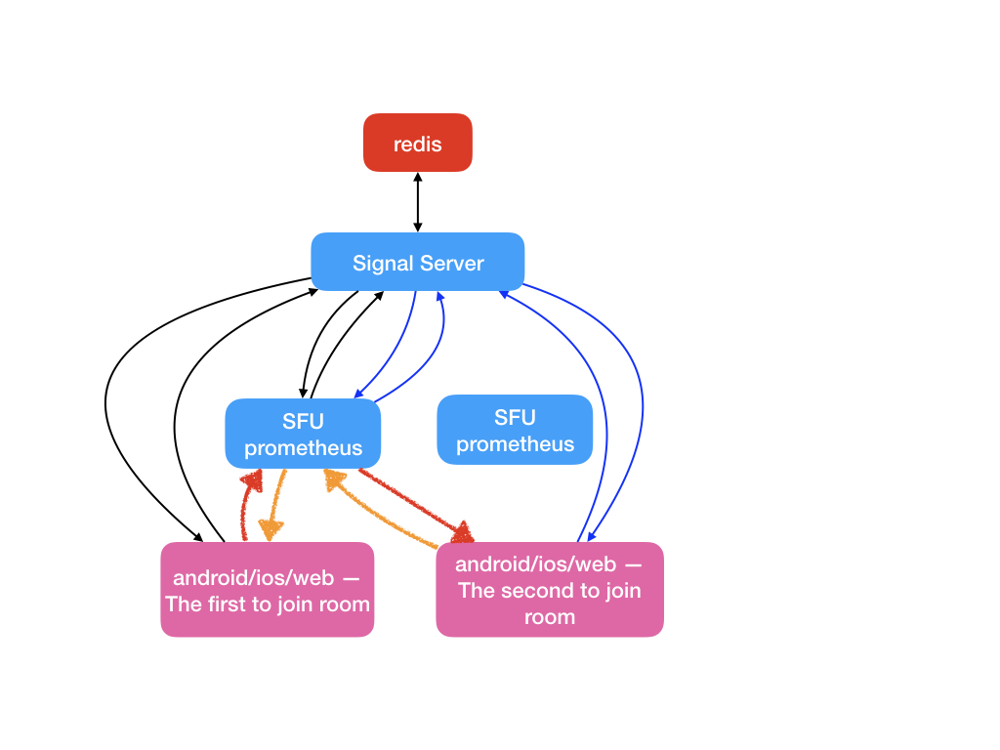

# sdp


```
o=sessionId sessionVersion ipCreatedSDP
a=group:BUNDLE  --- establishes a relationship between several media lines included in the SDP
a=msid-semantic WMS
m= meida line
c= ---- my ip
a=rtcp --- rtcp uses port
a=candidate:    1/2 [rtp/rtcp] udp  [priority] 
a=extmap 
```

不懂的sdp
```
a=fmtp:100 profile-id=2
a=fmtp:102 level-asymmetry-allowed=1;packetization-mode=1;profile-level-id=42001f
```


https://blog.csdn.net/china_jeffery/article/details/79991986


# Rtcp信息

Chrome作为发送方，会发送:

* 500 ms 发送一个 Sender Report

Chrome作为接收方：

* RR (201) 2s一个
* AVB RTCP (208) 和RR 一起发送
* Summary (209) 和RR 一起发送
* Generic-FeedBack (205)
  * NACK
* Payload-Feedback (206)
  * PLI
  
# svc

- sdp: https://www.rfc-editor.org/rfc/rfc6190#section-7.3.1

# Sender

* frag
* ~~gen timestamp~~
* gen error correction
* reorder frames
* ssrs colision
* congrestion controll

# Congestion Control

* TCP-Friendly Rate Control
* RTSP (RTP over TCP)
* RAP (Rate Adaptation Protocol)

# Other 

* CRTP
* ROHC


# dtls


pion作为client的cipher suite：

```
c0 2b Cipher Suite: TLS_ECDHE_ECDSA_WITH_AES_128_GCM_SHA256 (0xc02b)
c0 2f Cipher Suite: TLS_ECDHE_RSA_WITH_AES_128_GCM_SHA256 (0xc02f)
c0 0a Cipher Suite: TLS_ECDHE_ECDSA_WITH_AES_256_CBC_SHA (0xc00a)
00 35 Cipher Suite: TLS_RSA_WITH_AES_256_CBC_SHA (0x0035)
```


# Arch




* signal server collects basic info from sfus stores to redis
  * cpu
  * streams count
  * ....
* client1 (the first to join room) sends request to signal server, return sdps and which sfu to connect, save the infos to redis
* client2 (not the first to join room) sends request to signal server, return sdps and which sfu to connect ( client1 sfu ), save the infos to redis


# References

## Book 

* RTP: Audio and Video for the Internet 
* Learning WebRTC
* Getting Started with WebRTC
* Real-Time Communication with WebRTC
* webrtc cookbook

## RFCs

### Proposal

* https://w3c.github.io/webrtc-quic/

## Standards

* https://tools.ietf.org/wg/rtcweb/
* https://webrtc.org/
* https://www.w3.org/TR/webrtc/

## Urls

* https://developer.ridgerun.com/wiki/index.php?title=GstWebRTC_-_WebRTC_Fundamentals
* https://hpbn.co/webrtc/
* https://github.com/pions/webrtc/wiki/Relative-Drafts-And-Usages

## Codes

* https://github.com/pions/webrtc
* https://github.com/spebsd/live-webrtcsignaling
